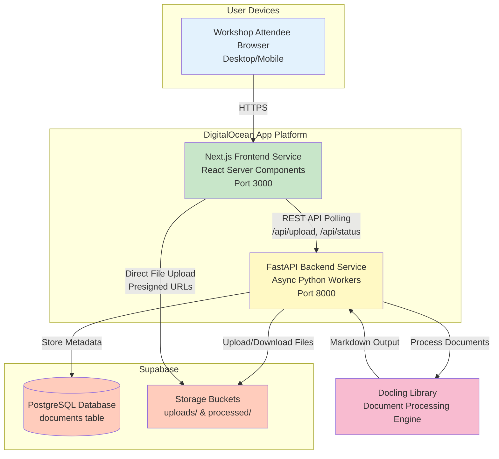

# Workshop Document Processor - Fullstack Architecture Document

## Introduction

This document outlines the complete fullstack architecture for **Workshop Document Processor**, including backend systems, frontend implementation, and their integration. It serves as the single source of truth for AI-driven development, ensuring consistency across the entire technology stack.

This unified approach combines what would traditionally be separate backend and frontend architecture documents, streamlining the development process for modern fullstack applications where these concerns are increasingly intertwined.

### Starter Template or Existing Project

**N/A - Greenfield Project**

No starter templates are being used. This is a new greenfield project with a custom monorepo architecture tailored specifically for the Workshop Document Processor requirements: Next.js 14 frontend, FastAPI backend, and DigitalOcean App Platform deployment.

### Change Log

| Date | Version | Description | Author |
|------|---------|-------------|--------|
| 2025-10-04 | 1.0 | Initial architecture creation from PRD and front-end spec | Architect Agent |

---

## High Level Architecture

### Technical Summary

The Workshop Document Processor employs a **two-service monorepo architecture** with a Next.js 14 frontend and FastAPI backend deployed as separate containers on DigitalOcean App Platform. The frontend serves a responsive React UI with server components for optimal performance, while the backend handles CPU-intensive Docling document processing in async Python workers. Communication follows a simple HTTP polling pattern—frontend initiates uploads, backend processes via Docling, and status endpoints provide real-time updates. Supabase provides dual services: PostgreSQL for document metadata tracking and Storage for file persistence (uploads/processed buckets). This architecture achieves the PRD's 13-day timeline through pragmatic technology choices (boring, proven stacks), supports 30 concurrent workshop users via DigitalOcean auto-scaling, and operates within the $10-12/month budget constraint by leveraging serverless-adjacent platforms.

### Platform and Infrastructure Choice

**Platform:** DigitalOcean App Platform
**Key Services:**
- DigitalOcean Apps (frontend container: Next.js, backend container: FastAPI)
- DigitalOcean Managed Databases (optional Redis cache if needed)
- Supabase PostgreSQL (document metadata)
- Supabase Storage (file storage with private buckets)
- DigitalOcean Monitoring (built-in metrics, no external APM)

**Deployment Host and Regions:**
- Primary: DigitalOcean NYC3 or SFO3 datacenter (choose closest to workshop location)
- Supabase: US region matching DigitalOcean for latency optimization

### Repository Structure

**Structure:** Monorepo
**Monorepo Tool:** npm workspaces (built-in, zero-config)
**Package Organization:** `/frontend` and `/backend` as separate workspace roots, optional `/packages/shared` for TypeScript types shared between services

### High Level Architecture Diagram



### Architectural Patterns

- **Monorepo with Separate Services** - Frontend and backend deployed independently as containers but versioned together - _Rationale:_ Atomic commits ensure API contract changes are synchronized while allowing independent scaling of services

- **Jamstack-Adjacent Architecture** - Static-first frontend with serverless-style backend processing - _Rationale:_ Next.js server components provide static shell with dynamic islands, FastAPI handles stateless async processing

- **Polling-Based Status Updates** - Frontend polls backend /api/status every 2 seconds instead of WebSockets - _Rationale:_ Simpler implementation, sufficient for 30-120 second processing times

- **Repository Pattern (Backend)** - Abstract data access logic for documents table and storage buckets - _Rationale:_ Enables testing with mocked storage, separates business logic from infrastructure

- **Component-Based UI with Server Components** - Next.js 14 App Router with React Server Components for static content, Client Components for interactivity - _Rationale:_ Optimizes bundle size, improves initial page load

- **Async Processing with Timeout Guards** - FastAPI background tasks with 5-minute hard timeout on Docling operations - _Rationale:_ Prevents hanging requests from exhausting workers

---

## Tech Stack

| Category | Technology | Version | Purpose | Rationale |
|----------|-----------|---------|---------|-----------|
| Frontend Language | TypeScript | 5.x | Type-safe frontend development | Catches errors at compile-time |
| Frontend Framework | Next.js | 14.x (App Router) | React framework with SSR/SSG | Server components reduce bundle size |
| UI Component Library | shadcn/ui | Latest | Accessible component primitives | WCAG AA compliant, no dependencies |
| State Management | React Context API + hooks | Built-in (React 18) | Upload/processing state | Avoids Redux/Zustand overhead |
| Backend Language | Python | 3.11+ | Async backend with Docling | Docling is Python-native |
| Backend Framework | FastAPI | 0.104+ | Async REST API framework | Automatic OpenAPI docs, Pydantic validation |
| API Style | REST | - | HTTP JSON API | Simplest for 6 endpoints |
| Database | PostgreSQL (Supabase) | 15.x | Document metadata persistence | ACID compliance |
| Cache | None (MVP) | - | Optional Redis | Not required for stateless polling |
| File Storage | Supabase Storage | Latest | Upload/processed files | Private buckets, S3-compatible |
| Authentication | None (MVP) | - | Internal workshop use | Add Supabase Auth post-workshop |
| Frontend Testing | Vitest + React Testing Library | Vitest 1.x, RTL 14.x | Component tests | Fast Vite-based runner |
| Backend Testing | pytest + pytest-asyncio | pytest 7.x | API and integration tests | Async test support |
| E2E Testing | Manual (MVP) | - | End-to-end validation | 13-day timeline constraint |
| Build Tool | npm | 9.x (Node 20 LTS) | Package management | npm workspaces for monorepo |
| Bundler | Vite (Next.js internal) | Next.js bundled | Frontend bundling | Handled by Next.js |
| IaC Tool | DigitalOcean App Spec YAML | - | Deployment config | App Platform native |
| CI/CD | GitHub Actions | - | Automated testing & deployment | Free, DO integration |
| Monitoring | DigitalOcean Monitoring | Built-in | Service metrics | Free with App Platform |
| Logging | DigitalOcean Logs | Built-in | Application logs | 7-day retention |
| CSS Framework | TailwindCSS | 3.x | Utility-first styling | Pairs with shadcn/ui |
| Form Handling | react-hook-form | 7.x | Form validation | Minimal re-renders |
| File Upload | react-dropzone | 14.x | Drag-and-drop | Mobile touch support |
| HTTP Client (Frontend) | fetch (native) | Built-in | API requests | No axios needed |
| Python Package Manager | pip + requirements.txt | Built-in | Backend dependencies | Standard Python tooling |
| Code Quality (Frontend) | ESLint + Prettier | ESLint 8.x, Prettier 3.x | Linting & formatting | Next.js ESLint config |
| Code Quality (Backend) | Black + Ruff | Black 23.x, Ruff 0.1+ | Python formatting & linting | Fast linting with Ruff |
| Validation (Backend) | Pydantic | 2.x | Request/response schemas | Type-safe validation |

---

## Data Models

### Document

**Purpose:** Tracks a user's uploaded document through the processing pipeline, storing metadata, status, and references to files in Supabase Storage.

**Key Attributes:**
- `id`: UUID (primary key) - Unique identifier
- `filename`: string - Original filename from upload
- `status`: enum - 'queued' | 'processing' | 'complete' | 'failed'
- `processing_options`: JSON - `{ ocr: boolean, mode: 'fast' | 'quality' }`
- `upload_path`: string (nullable) - Supabase Storage path to original file
- `processed_path`: string (nullable) - Supabase Storage path to markdown
- `file_size`: integer - Original file size in bytes
- `mime_type`: string - Original file MIME type
- `error_message`: string (nullable) - Human-readable error if failed
- `created_at`: timestamp - When upload started
- `completed_at`: timestamp (nullable) - When processing finished

#### TypeScript Interface

```typescript
interface Document {
  id: string; // UUID
  filename: string;
  status: 'queued' | 'processing' | 'complete' | 'failed';
  processing_options: {
    ocr: boolean;
    mode: 'fast' | 'quality';
  };
  upload_path: string | null;
  processed_path: string | null;
  file_size: number;
  mime_type: string;
  error_message: string | null;
  created_at: string; // ISO 8601
  completed_at: string | null;
}

interface ProcessingOptions {
  ocr: boolean;
  mode: 'fast' | 'quality';
}
```

#### Relationships

- **One-to-One with Upload File:** Each document has one file in `uploads/` bucket
- **One-to-One with Processed File:** Each complete document has one file in `processed/` bucket
- **No User Relationship (MVP):** No auth, no user association

---

## API Specification

### REST API Endpoints

**Base URL:** `https://api.workshop-doc-processor.ondigitalocean.app`

#### GET /api/health
Health check for monitoring

**Response 200:**
```json
{
  "status": "ok",
  "timestamp": "2025-10-04T14:30:00Z"
}
```

#### POST /api/upload
Upload document for processing

**Request:**
```
Content-Type: multipart/form-data

file: binary (PDF, DOCX, PPTX, XLSX)
ocr: boolean
mode: "fast" | "quality"
```

**Response 201:**
```json
{
  "id": "a1b2c3d4...",
  "filename": "report.pdf",
  "status": "queued",
  "processing_options": {
    "ocr": false,
    "mode": "fast"
  },
  "file_size": 2457600,
  "mime_type": "application/pdf",
  "created_at": "2025-10-04T14:30:00Z"
}
```

**Response 400:** Validation error (file too large, unsupported format)

#### POST /api/process/{document_id}
Trigger document processing

**Response 202:** Processing started

#### GET /api/status/{document_id}
Get processing status (poll every 2 seconds)

**Response 200:**
```json
{
  "id": "a1b2c3d4...",
  "filename": "report.pdf",
  "status": "processing",
  "processing_options": {...},
  "created_at": "2025-10-04T14:30:00Z"
}
```

#### GET /api/download/{document_id}
Download processed markdown

**Response 200:** Streams markdown file
```
Content-Type: text/markdown
Content-Disposition: attachment; filename="report.md"
```

**Error Response Format:**
```json
{
  "error": {
    "code": "FILE_TOO_LARGE",
    "message": "File too large (15MB) - maximum 10MB",
    "timestamp": "2025-10-04T14:30:00Z",
    "requestId": "req_abc123"
  }
}
```

---

## Database Schema

### PostgreSQL Schema (Supabase)

```sql
-- Enable UUID extension
CREATE EXTENSION IF NOT EXISTS "uuid-ossp";

-- Documents table
CREATE TABLE documents (
    id UUID PRIMARY KEY DEFAULT uuid_generate_v4(),
    filename VARCHAR(255) NOT NULL,
    status VARCHAR(20) NOT NULL CHECK (status IN ('queued', 'processing', 'complete', 'failed')),
    processing_options JSONB NOT NULL,
    upload_path VARCHAR(500),
    processed_path VARCHAR(500),
    file_size INTEGER NOT NULL,
    mime_type VARCHAR(100) NOT NULL,
    error_message TEXT,
    created_at TIMESTAMP WITH TIME ZONE NOT NULL DEFAULT NOW(),
    completed_at TIMESTAMP WITH TIME ZONE
);

-- Indexes for performance
CREATE INDEX idx_documents_status ON documents(status);
CREATE INDEX idx_documents_created_at ON documents(created_at DESC);

-- Supabase Storage Buckets (configured via UI)
-- Bucket: uploads (private)
-- Bucket: processed (private)
```

---

## Frontend Architecture

### Project Structure

```
frontend/src/
├── app/                        # Next.js 14 App Router
│   ├── layout.tsx             # Root layout
│   ├── page.tsx               # Upload page
│   └── instructions/
│       └── page.tsx           # Instructions
├── components/
│   ├── ui/                    # shadcn/ui components
│   ├── FileDropzone.tsx
│   ├── ProcessingCard.tsx
│   ├── StatusAlert.tsx
│   ├── ProcessingOptions.tsx
│   └── Header.tsx
├── hooks/
│   ├── useFileUpload.ts
│   ├── useDocumentStatus.ts
│   └── useDownload.ts
├── lib/
│   ├── api.ts                 # API client
│   ├── validation.ts
│   └── utils.ts
├── types/
│   └── index.ts
└── styles/
    └── globals.css
```

### State Management

```typescript
// Upload state via React Context
interface UploadState {
  file: File | null
  documentId: string | null
  status: 'idle' | 'uploading' | 'queued' | 'processing' | 'complete' | 'failed'
  options: ProcessingOptions
  error: string | null
}
```

### API Client Example

```typescript
// lib/api.ts
const API_BASE_URL = process.env.NEXT_PUBLIC_API_URL || 'http://localhost:8000'

export async function uploadDocument(
  file: File,
  options: ProcessingOptions
): Promise<Document> {
  const formData = new FormData()
  formData.append('file', file)
  formData.append('ocr', String(options.ocr))
  formData.append('mode', options.mode)

  const response = await fetch(`${API_BASE_URL}/api/upload`, {
    method: 'POST',
    body: formData
  })

  if (!response.ok) {
    const error = await response.json()
    throw new Error(error.error.message)
  }

  return response.json()
}
```

---

## Backend Architecture

### Project Structure

```
backend/src/
├── main.py                    # FastAPI app
├── api/
│   └── routes/
│       ├── health.py
│       ├── upload.py
│       ├── process.py
│       ├── status.py
│       └── download.py
├── services/
│   ├── document_service.py
│   ├── storage_service.py
│   └── processing_service.py
├── repositories/
│   └── document_repository.py
├── models/
│   ├── document.py
│   └── errors.py
├── config/
│   └── settings.py
├── middleware/
│   ├── error_handler.py
│   └── logging.py
└── utils/
    ├── validation.py
    └── timeout.py
```

### Service Layer Pattern

```python
# services/document_service.py
class DocumentService:
    def __init__(self):
        self.repository = DocumentRepository()
        self.storage = StorageService()
        self.processor = ProcessingService()

    async def create_document(self, file: UploadFile, options: ProcessingOptions):
        # Upload to storage
        upload_path = await self.storage.upload_file(file)

        # Create DB record
        document = await self.repository.create({
            'filename': file.filename,
            'status': 'queued',
            'processing_options': options,
            'upload_path': upload_path,
            'file_size': file.size,
            'mime_type': file.content_type
        })

        return document
```

### Repository Pattern

```python
# repositories/document_repository.py
from supabase import create_client

class DocumentRepository:
    def __init__(self):
        self.supabase = create_client(settings.SUPABASE_URL, settings.SUPABASE_KEY)

    async def create(self, data: dict):
        result = self.supabase.table('documents').insert(data).execute()
        return result.data[0]

    async def get_by_id(self, document_id: str):
        result = self.supabase.table('documents').select('*').eq('id', document_id).execute()
        return result.data[0] if result.data else None

    async def update_status(self, document_id: str, status: str, **kwargs):
        result = self.supabase.table('documents').update({
            'status': status,
            'completed_at': 'NOW()',
            **kwargs
        }).eq('id', document_id).execute()
        return result.data[0]
```

---

## Unified Project Structure

```
workshop-document-processor/
├── .github/workflows/
│   ├── ci.yaml
│   └── deploy.yaml
├── frontend/
│   ├── src/
│   ├── public/
│   ├── tests/
│   ├── package.json
│   └── next.config.js
├── backend/
│   ├── src/
│   ├── tests/
│   ├── requirements.txt
│   └── pyproject.toml
├── docs/
│   ├── prd.md
│   ├── front-end-spec.md
│   └── architecture.md
├── .digitalocean/
│   └── app.yaml
├── package.json
└── README.md
```

---

## Development Workflow

### Prerequisites

```bash
# Node.js 20 LTS
nvm install 20

# Python 3.11+
pyenv install 3.11
```

### Initial Setup

```bash
# Clone and install
git clone <repo>
cd workshop-document-processor
npm install

# Frontend setup
cd frontend
npm install
cp .env.local.example .env.local

# Backend setup
cd ../backend
python -m venv venv
source venv/bin/activate
pip install -r requirements.txt
cp .env.example .env
```

### Development Commands

```bash
# Start all services
npm run dev

# Frontend only
cd frontend && npm run dev  # http://localhost:3000

# Backend only
cd backend && uvicorn src.main:app --reload  # http://localhost:8000

# Run tests
npm run test
```

### Environment Variables

```bash
# Frontend (.env.local)
NEXT_PUBLIC_API_URL=http://localhost:8000
NEXT_PUBLIC_SUPABASE_URL=https://xxx.supabase.co
NEXT_PUBLIC_SUPABASE_ANON_KEY=xxx

# Backend (.env)
SUPABASE_URL=https://xxx.supabase.co
SUPABASE_KEY=xxx
MAX_FILE_SIZE=10485760
PROCESSING_TIMEOUT=300
```

---

## Deployment Architecture

### DigitalOcean App Platform

**Frontend Service:**
- Build: `cd frontend && npm run build`
- Output: `frontend/.next`
- Auto CDN enabled

**Backend Service:**
- Build: `cd backend && pip install -r requirements.txt`
- Run: `cd backend && uvicorn src.main:app --host 0.0.0.0 --port 8000`
- Container deployment

### CI/CD Pipeline

```yaml
# .github/workflows/deploy.yaml
name: Deploy

on:
  push:
    branches: [main]

jobs:
  test:
    runs-on: ubuntu-latest
    steps:
      - uses: actions/checkout@v3
      - name: Run tests
        run: npm run test

  deploy:
    needs: test
    runs-on: ubuntu-latest
    steps:
      - uses: digitalocean/app_action@v1
        with:
          token: ${{ secrets.DIGITALOCEAN_TOKEN }}
```

### Environments

| Environment | Frontend URL | Backend URL | Purpose |
|------------|--------------|-------------|---------|
| Development | localhost:3000 | localhost:8000 | Local dev |
| Staging | staging-frontend.ondigitalocean.app | staging-api.ondigitalocean.app | Pre-production |
| Production | workshop-doc-processor.ondigitalocean.app | api.workshop-doc-processor.ondigitalocean.app | Live |

---

## Security and Performance

### Security

**Frontend:**
- CSP Headers: `default-src 'self'`
- XSS Prevention: React auto-escapes
- No sensitive data in localStorage

**Backend:**
- Pydantic input validation
- File type/size checks server-side
- CORS: `allow_origins=['https://workshop-doc-processor.ondigitalocean.app']`
- 5-minute processing timeout

### Performance

**Frontend:**
- Bundle size: < 200KB initial JS
- Server components for static content
- CDN caching for assets

**Backend:**
- Response time: < 100ms (status endpoint)
- Processing: < 2 min (p95)
- Database indexes on status, created_at
- Connection pooling

---

## Testing Strategy

### Test Organization

**Frontend:**
```
frontend/tests/
├── unit/
│   ├── components/
│   └── lib/
└── integration/
```

**Backend:**
```
backend/tests/
├── unit/
│   └── services/
└── integration/
    └── test_upload_endpoint.py
```

### Test Examples

**Frontend Component Test:**
```typescript
import { render, screen } from '@testing-library/react'
import { FileDropzone } from '@/components/FileDropzone'

test('accepts valid PDF', () => {
  const onFileSelect = vi.fn()
  render(<FileDropzone onFileSelect={onFileSelect} />)

  const file = new File(['content'], 'test.pdf', { type: 'application/pdf' })
  // ... trigger drop
  expect(onFileSelect).toHaveBeenCalledWith(file)
})
```

**Backend API Test:**
```python
def test_upload_valid_pdf():
    with open('tests/fixtures/sample.pdf', 'rb') as f:
        response = client.post(
            '/api/upload',
            files={'file': ('test.pdf', f, 'application/pdf')},
            data={'ocr': 'false', 'mode': 'fast'}
        )

    assert response.status_code == 201
    assert response.json()['status'] == 'queued'
```

---

## Coding Standards

### Critical Rules

- **Type Sharing:** Define types in `backend/src/models/` (Pydantic) and `frontend/src/types/` (TypeScript)
- **API Calls:** Use API client functions from `lib/api.ts`, never direct fetch in components
- **Environment Variables:** Access via config objects, never `process.env` directly
- **Error Handling:** All API routes use FastAPI exception handlers with standard error format
- **File Validation:** Always validate client and server-side
- **Async/Await:** All I/O operations must use async/await

### Naming Conventions

| Element | Frontend | Backend | Example |
|---------|----------|---------|---------|
| Components | PascalCase | - | `UserProfile.tsx` |
| Hooks | camelCase 'use' | - | `useAuth.ts` |
| API Routes | - | snake_case | `/api/upload` |
| Functions | - | snake_case | `process_document()` |
| Database Tables | - | snake_case | `documents` |

---

## Error Handling

### Error Response Format

```typescript
interface ApiError {
  error: {
    code: string;        // FILE_TOO_LARGE, PROCESSING_TIMEOUT
    message: string;     // User-friendly message
    timestamp: string;
    requestId: string;
  };
}
```

### Frontend Error Handling

```typescript
try {
  await uploadDocument(file, options)
} catch (error) {
  setError(error instanceof Error ? error.message : 'Upload failed')
}
```

### Backend Error Handling

```python
@app.exception_handler(HTTPException)
async def http_exception_handler(request, exc):
    return JSONResponse(
        status_code=exc.status_code,
        content={
            "error": {
                "code": exc.detail.get("code"),
                "message": exc.detail.get("message"),
                "timestamp": datetime.utcnow().isoformat(),
                "requestId": str(uuid.uuid4())
            }
        }
    )
```

---

## Monitoring and Observability

### Monitoring Stack

- **Frontend:** DigitalOcean CDN metrics
- **Backend:** DigitalOcean App Platform metrics (CPU, memory, request rate)
- **Error Tracking:** DigitalOcean Logs (7-day retention)
- **Performance:** Manual performance.mark() timing

### Key Metrics

**Frontend:**
- Core Web Vitals (LCP, FID, CLS)
- JavaScript errors
- API response times

**Backend:**
- Request rate (req/sec)
- Error rate (4xx, 5xx %)
- Response time (p50, p95, p99)
- Processing duration by file type

**Business:**
- Documents uploaded
- Processing success rate
- Average processing time
- File size distribution

---

## Architecture Validation

### Strengths

✅ Clear separation of concerns (frontend/backend/data)
✅ Well-defined API contracts (OpenAPI spec)
✅ Pragmatic tech choices for 13-day timeline
✅ Scalable to 30 concurrent users
✅ Comprehensive error handling

### Minor Gaps

⚠️ Docling version not specified (confirm latest stable)
⚠️ No cleanup for stuck "processing" documents (add post-MVP)
⚠️ Manual E2E only (acceptable for MVP)

### Decision

**✅ READY FOR DEVELOPMENT**

Architecture is complete, implementable within 13-day timeline, and aligned with all PRD requirements. Proceed with Epic 1, Story 1.1.

---

## Next Steps

1. **Create repository:** Initialize monorepo structure
2. **Setup Supabase:** Create project, run schema, configure buckets
3. **Configure DigitalOcean:** Create app, set environment variables
4. **Begin Epic 1:** Follow PRD story acceptance criteria
5. **Parallel development:** Frontend and backend can proceed simultaneously

**Architecture Document Complete** ✓
