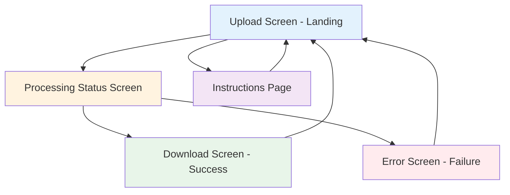
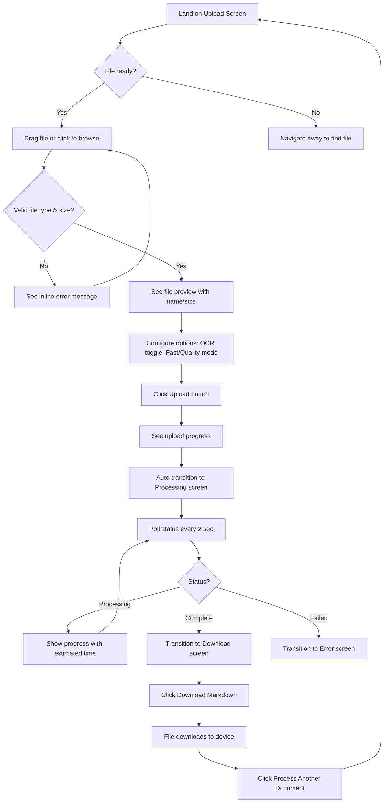
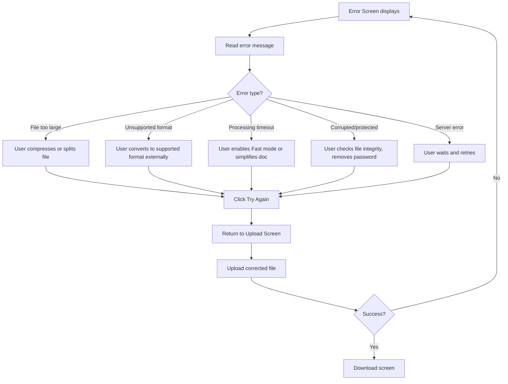
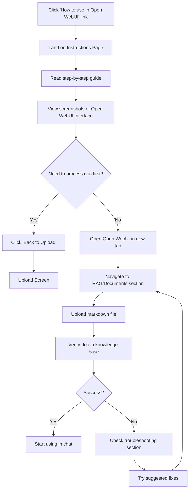

# Workshop Document Processor UI/UX Specification

This document defines the user experience goals, information architecture, user flows, and visual design specifications for Workshop Document Processor's user interface. It serves as the foundation for visual design and frontend development, ensuring a cohesive and user-centered experience.

## Overall UX Goals & Principles

### Target User Personas

**Workshop Attendee:** Internal employees (30 people) attending the October 17, 2025 workshop who need to convert their office documents for use in Open WebUI's RAG system. Technical skill levels vary from non-technical to advanced users. Primary need: fast, error-free document conversion without requiring manual formatting or technical knowledge.

### Usability Goals

- **Instant comprehension:** Users understand the complete workflow (upload → process → download) within 3 seconds of landing
- **Zero learning curve:** Tool requires no documentation, training, or assistance to complete core task
- **Error resilience:** 95%+ successful conversion rate with self-correcting error messages when issues occur
- **Speed perception:** Processing feels fast through real-time status updates, even during 1-2 minute waits
- **Mobile accessibility:** Full functionality on phones/tablets for attendees without laptops

### Design Principles

1. **Invisible Complexity** - Sophisticated Docling processing and Supabase storage operate behind a deceptively simple interface
2. **One Action Per Screen** - Each view focuses on a single user decision to avoid cognitive overload
3. **Status-Driven UI** - Interface morphs based on processing state, showing only relevant actions at each stage
4. **Immediate Feedback** - Every user action produces instant visual response to maintain engagement
5. **Drag-and-Drop First** - Primary interaction prioritizes the most intuitive upload method

### Change Log

| Date | Version | Description | Author |
|------|---------|-------------|--------|
| 2025-10-04 | 1.0 | Initial UI/UX specification creation | UX Expert |

## Information Architecture (IA)

### Site Map / Screen Inventory



### Navigation Structure

**Primary Navigation:** Single persistent element - "How to use in Open WebUI" link in top-right corner, accessible from all screens, opens Instructions Page

**Secondary Navigation:** Context-aware action buttons that change per screen state:
- Upload Screen: No secondary nav (single action: upload)
- Processing Screen: "Cancel" button (if technically feasible)
- Success Screen: "Download Markdown" + "Process Another Document"
- Error Screen: "Try Again" button
- Instructions Page: "Back to Upload" button

**Breadcrumb Strategy:** No breadcrumbs needed - application is only 2 levels deep (main flow vs. instructions), and current screen is always visually obvious from UI state

## User Flows

### Flow 1: Primary Document Conversion (Happy Path)

**User Goal:** Convert an office document to AI-optimized markdown for use in Open WebUI

**Entry Points:** Direct URL access (shared in workshop), bookmark from previous session

**Success Criteria:** User successfully downloads markdown file matching their uploaded document within 2 minutes

#### Flow Diagram



#### Edge Cases & Error Handling

- **Network failure during upload:** Show "Upload failed - check connection and try again" with retry button
- **Processing timeout (>5 min):** Automatic fail status with message "Processing took too long - try Fast mode"
- **Browser closes during processing:** Document ID in URL allows status check on return (if implemented)
- **Downloaded file won't open:** Instructions page explains markdown viewers/editors

**Notes:** This flow handles ~95% of workshop scenarios per PRD success rate target

### Flow 2: Error Recovery Path

**User Goal:** Understand what went wrong and successfully retry document conversion

**Entry Points:** Processing failure, validation error, or timeout

**Success Criteria:** User understands the error cause and completes successful conversion after correction

#### Flow Diagram



#### Edge Cases & Error Handling

- **Same error repeats 3+ times:** Suggest contacting workshop facilitator (displayed after 3rd failure)
- **User doesn't understand error message:** Instructions link always available in top nav
- **Multiple files fail:** Pattern recognition could suggest "try smaller files" if size-related

**Notes:** Error messages must be actionable per PRD NFR7 (100% error coverage with self-correction guidance)

### Flow 3: Learning How to Use Converted Files

**User Goal:** Understand how to upload processed markdown to Open WebUI for RAG usage

**Entry Points:** "How to use in Open WebUI" link (available on all screens), post-download curiosity

**Success Criteria:** User successfully uploads markdown to Open WebUI and verifies it appears in knowledge base

#### Flow Diagram



#### Edge Cases & Error Handling

- **Open WebUI interface changed:** Screenshots may be outdated (note last updated date on instructions)
- **Markdown not appearing in RAG:** Troubleshooting section addresses file format, workspace selection issues
- **AI responses still inaccurate:** Tips section explains document quality impacts RAG performance

**Notes:** This flow bridges tool usage with actual RAG implementation per PRD Story 3.1 requirements

## Wireframes & Mockups

**Primary Design Files:** Given the 13-day timeline, this project will use **component-driven development with shadcn/ui** rather than traditional wireframing tools. Key screens will be built directly in code using the specifications below, with iterative refinement during development.

**Alternative Approach:** If visual mockups are desired before development, recommend using Figma or v0.dev (AI UI generator) for rapid prototyping. Export links can be added here once created.

### Key Screen Layouts

#### Screen 1: Upload Screen (Landing Page)

**Purpose:** Primary entry point for document upload with processing configuration options

**Key Elements:**
- Large drag-and-drop zone (min 400px height on desktop, full viewport minus header on mobile) with dashed border and upload icon
- Centered text: "Drag your document here or click to browse" with supported formats below (PDF, DOCX, PPTX, XLSX)
- File size limit notice: "Maximum 10MB" in muted text
- Processing options panel below drop zone:
  - OCR toggle (checkbox): "Enable OCR for scanned documents"
  - Processing mode selector (radio buttons): "Fast" (default) / "Quality"
  - Help text for each option in smaller font
- Primary action button: "Upload Document" (disabled until file selected)
- Persistent header with app title and "How to use in Open WebUI" link (top-right)

**Interaction Notes:**
- Drop zone highlights on drag-over with blue border
- File preview card appears after selection showing filename, size, and remove icon
- Upload button activates with primary color when file selected
- Mobile: click-to-browse triggers native file picker (drag-drop may not work on all devices)

**Design File Reference:** *To be created in development or v0.dev if visual mockups needed*

#### Screen 2: Processing Status Screen

**Purpose:** Real-time feedback during document conversion with progress visibility

**Key Elements:**
- Centered content card (max 600px width)
- Large animated spinner or progress indicator (primary color)
- Status text hierarchy:
  - Main heading: Current stage ("Processing document...")
  - Subtext: Estimated time remaining ("~30 seconds" or "~2 minutes")
  - Filename being processed in muted text
- Optional: Cancel button below progress indicator (if technically feasible)
- Same persistent header as Upload screen

**Interaction Notes:**
- Auto-polls backend every 2 seconds for status updates
- Smooth transitions between status messages (fade effect, no jarring jumps)
- Processing mode displayed: "Fast mode" or "Quality mode with OCR"
- No user action required - automatically transitions to Download or Error screen

**Design File Reference:** *To be created in development*

#### Screen 3: Download Screen (Success State)

**Purpose:** Confirm successful processing and enable markdown download

**Key Elements:**
- Success icon (green checkmark, large 64px+)
- Heading: "Processing Complete!"
- Processed filename display: "report.md (45 KB)" in prominent text
- Primary action button (large, green): "Download Markdown"
- Secondary action button (outlined): "Process Another Document"
- Same persistent header

**Interaction Notes:**
- Download button triggers immediate file download (content-disposition: attachment)
- "Process Another Document" clears state and returns to Upload screen
- Success state persists if user navigates away and returns (via URL with document ID)

**Design File Reference:** *To be created in development*

#### Screen 4: Error Screen (Failure State)

**Purpose:** Clearly communicate errors with actionable recovery guidance

**Key Elements:**
- Error icon (red alert triangle, 64px)
- Error heading: Specific error type ("File Too Large" / "Processing Failed" / etc.)
- Error message body: Actionable guidance (2-3 sentences max)
  - Example: "Your file is 15MB but the maximum size is 10MB. Try compressing your PDF or splitting it into multiple files."
- Primary action button (blue): "Try Again"
- Optional: "Contact Support" link if repeated failures detected (3+ attempts)
- Same persistent header

**Interaction Notes:**
- "Try Again" returns to Upload screen, clearing previous state
- Error tracking increments failure counter (client-side storage) to detect repeated issues
- Error messages must match backend error types exactly (per PRD Story 2.3)

**Design File Reference:** *To be created in development*

#### Screen 5: Instructions Page

**Purpose:** Step-by-step guide for uploading processed markdown to Open WebUI

**Key Elements:**
- Page title: "How to Use in Open WebUI"
- Numbered step list (1-6 steps):
  1. Process your document using this tool
  2. Download the markdown file
  3. Open Open WebUI
  4. Navigate to RAG/Documents section
  5. Upload the markdown file
  6. Verify document appears in knowledge base
- Screenshot or annotated image for steps 3-6 (Open WebUI interface)
- Expandable "Troubleshooting" section (accordion):
  - "Markdown not appearing" → check file format, workspace
  - "AI responses inaccurate" → document quality tips
- Tips section: "Use Quality mode for complex documents", "Enable OCR for scanned PDFs"
- "Back to Upload" button (prominent, top and bottom of page)

**Interaction Notes:**
- Instructions accessible from all screens via header link
- Screenshots should have last-updated date (note potential UI drift)
- Troubleshooting accordion collapsed by default, expands on click
- Mobile: vertical scrolling, images scale to viewport width

**Design File Reference:** *Screenshots of Open WebUI to be added in Story 3.1*

## Component Library / Design System

**Design System Approach:** This project uses **shadcn/ui component library** built on Radix UI primitives and styled with TailwindCSS. This approach provides accessible, pre-built components with minimal setup time—critical for the 13-day timeline. No custom design system is needed; shadcn/ui components will be customized via Tailwind theme configuration to match brand colors and spacing.

**Rationale:** shadcn/ui is copy-paste components (not a dependency), allowing customization without library lock-in. All components are WCAG AA compliant by default through Radix UI primitives.

### Core Components

#### Component 1: FileDropzone

**Purpose:** Primary file upload interface with drag-and-drop and click-to-browse functionality

**Variants:**
- Default (empty state): Dashed border, upload icon, instructional text
- Drag-over: Solid blue border, background highlight
- File selected: Solid border with file preview card inside

**States:**
- Idle: Awaiting file
- Drag-over: Active drag state (visual highlight)
- Selected: File chosen, preview displayed
- Disabled: During upload (prevents multiple uploads)
- Error: Validation failed (red border, error message)

**Usage Guidelines:**
- Minimum 400px height on desktop for large drop target
- Full viewport minus header on mobile
- Use `react-dropzone` library for drag-drop functionality
- Client-side validation triggers Error state before upload
- shadcn/ui components used: Card (container), Button (browse), Alert (errors)

#### Component 2: ProcessingCard

**Purpose:** Display real-time processing status with progress indication

**Variants:**
- Uploading: Progress bar with percentage
- Queued: Static spinner, "Waiting to process" message
- Processing: Animated spinner with estimated time

**States:**
- Active: Currently processing (animated spinner)
- Transitioning: Fading between status updates

**Usage Guidelines:**
- Max width 600px, centered on screen
- Poll backend every 2 seconds via React useEffect
- Smooth transitions using CSS fade (200ms duration)
- Display processing mode selected ("Fast" or "Quality with OCR")
- shadcn/ui components used: Card, Spinner (custom or lucide-react), Progress

#### Component 3: StatusAlert

**Purpose:** Display success, error, and informational messages with contextual styling

**Variants:**
- Success: Green background, checkmark icon, "Processing Complete!"
- Error: Red background, alert icon, specific error message
- Info: Blue background, info icon, guidance text

**States:**
- Visible: Displayed on screen
- Dismissed: Closed by user (if dismissible)

**Usage Guidelines:**
- Use shadcn/ui Alert component with variant prop
- Error variant includes actionable message (2-3 sentences max)
- Success variant includes file size and download CTA
- Icons from lucide-react: CheckCircle2, AlertTriangle, Info
- Always include primary action button within alert (Download, Try Again)

#### Component 4: ProcessingOptions

**Purpose:** Configure OCR and processing mode before upload

**Variants:**
- Compact (mobile): Vertical stack with full-width controls
- Expanded (desktop): Horizontal layout with inline help text

**States:**
- Default: OCR off, Fast mode selected
- OCR enabled: Checkbox checked, updates processing options
- Quality mode: Radio button selected, shows estimated longer time

**Usage Guidelines:**
- Use shadcn/ui Checkbox and RadioGroup components
- Help text (muted color) below each option explaining when to use
- State managed in React (lifted to parent component for upload payload)
- Mobile: Stack vertically, ensure 44px minimum touch targets

#### Component 5: ActionButton

**Purpose:** Primary and secondary CTAs throughout application

**Variants:**
- Primary: Solid background (blue), white text, for main actions
- Secondary: Outlined style, for alternative actions
- Success: Green background, for download action
- Destructive: Red background, for cancel/delete (if needed)

**States:**
- Default: Normal interactive state
- Hover: Slight color darkening, cursor pointer
- Disabled: Grayed out, no interaction (when file not selected)
- Loading: Spinner icon, text "Uploading..." or "Processing..."

**Usage Guidelines:**
- Use shadcn/ui Button component with variant prop
- Primary actions always prominent (larger size on mobile)
- Loading state uses lucide-react Loader2 icon with spin animation
- Disabled state during async operations (upload, processing)
- Full width on mobile (<640px), auto width on desktop

#### Component 6: InstructionsAccordion

**Purpose:** Expandable troubleshooting and tips sections on Instructions page

**Variants:**
- Single: One expandable section
- Multiple: Several sections (Troubleshooting, Tips)

**States:**
- Collapsed: Title visible, content hidden
- Expanded: Title and content visible

**Usage Guidelines:**
- Use shadcn/ui Accordion component with collapsible type
- Collapsed by default to reduce initial page length
- Icons indicate expand/collapse state (ChevronDown/ChevronUp)
- Mobile: Full width, adequate touch targets for accordion headers

## Branding & Style Guide

### Visual Identity

**Brand Guidelines:** This is an internal workshop tool with no formal corporate branding requirements. Design follows "enterprise-lite" aesthetic per PRD: trustworthy but not bureaucratic, clean and functional over visually polished.

**Design Philosophy:** Minimal distractions, maximum clarity. Every visual element serves a functional purpose—status indication, action guidance, or error prevention.

### Color Palette

| Color Type | Hex Code | Usage |
|------------|----------|-------|
| Primary | `#3b82f6` (blue-500) | Primary actions, links, drag-over states, focus indicators |
| Secondary | `#6b7280` (gray-500) | Secondary text, muted elements, help text |
| Accent | `#8b5cf6` (violet-500) | Instructional page, optional visual variety |
| Success | `#10b981` (emerald-500) | Positive feedback, download button, success states |
| Warning | `#f59e0b` (amber-500) | Processing states, cautions, important notices |
| Error | `#ef4444` (red-500) | Errors, validation failures, destructive actions |
| Neutral | `#f9fafb` (gray-50) to `#111827` (gray-900) | Text, borders, backgrounds (full gray scale) |

**Color Rationale:** Using Tailwind's default color palette ensures WCAG AA contrast ratios are pre-validated, consistency with modern web conventions, and no custom color management needed.

### Typography

#### Font Families

- **Primary:** `Inter` (sans-serif) - Clean, highly readable at all sizes, excellent for UI
- **Secondary:** `system-ui` fallback - Native system fonts if Inter fails to load
- **Monospace:** `'Courier New', monospace` - For file names, technical details (if needed)

**Font Loading:** Use `next/font` to optimize Inter loading with font-display: swap

#### Type Scale

| Element | Size | Weight | Line Height |
|---------|------|--------|-------------|
| H1 | 2.25rem (36px) | 700 (bold) | 2.5rem |
| H2 | 1.875rem (30px) | 600 (semibold) | 2.25rem |
| H3 | 1.5rem (24px) | 600 (semibold) | 2rem |
| Body | 1rem (16px) | 400 (regular) | 1.5rem |
| Small | 0.875rem (14px) | 400 (regular) | 1.25rem |

**Mobile Typography:** Base size remains 16px (prevents iOS zoom on input focus). Scale up heading sizes by 1.25x on desktop (≥768px).

### Iconography

**Icon Library:** `lucide-react` (included with shadcn/ui)

**Usage Guidelines:**
- Icon sizes: 20px (inline with text), 24px (buttons), 48-64px (status screens)
- Always pair icons with text labels for clarity (icon-only allowed for universally recognized actions like close/back)
- Key icons mapped to functions:
  - `Upload` - File upload action
  - `Loader2` - Processing spinner (with spin animation)
  - `CheckCircle2` - Success states
  - `AlertTriangle` - Error states
  - `Info` - Informational help
  - `ChevronDown/ChevronUp` - Accordion expand/collapse
  - `X` - Close/remove actions

### Spacing & Layout

**Grid System:** Tailwind's default 12-column grid with responsive breakpoints:
- Mobile: `<640px` - Single column, full-width components
- Tablet: `640px-1024px` - Centered content, max 768px width
- Desktop: `≥1024px` - Centered content, max 1200px width

**Spacing Scale:** Tailwind's default scale (4px base unit):
- Tight spacing: `space-y-2` (8px) for related elements
- Standard spacing: `space-y-4` (16px) for component separation
- Generous spacing: `space-y-8` (32px) for section breaks
- Component padding: `p-4` (16px) mobile, `p-6` (24px) desktop

**Layout Principles:**
- Centered content cards on all screens (max-width constraints prevent wide-screen sprawl)
- Generous whitespace around primary actions to prevent mis-taps
- Consistent component padding using Tailwind spacing scale

## Accessibility Requirements

### Compliance Target

**Standard:** WCAG 2.1 Level AA compliance for all user-facing components and interactions

**Rationale:** Level AA ensures workshop attendees with disabilities can complete all tasks independently. Higher than Level A (basic) but more achievable than AAA given the 13-day timeline.

### Key Requirements

**Visual:**
- **Color contrast ratios:** 4.5:1 minimum for normal text, 3:1 for large text (18px+ or 14px+ bold) and UI components
  - Tailwind default colors pre-validated for these ratios
  - Test all custom color combinations with browser DevTools or WebAIM contrast checker
- **Focus indicators:** Visible focus ring (2px solid outline) on all interactive elements with 3:1 contrast against background
  - Use Tailwind's `focus:ring-2 focus:ring-blue-500 focus:ring-offset-2` pattern
  - Never remove focus styles with `outline-none` without replacing with visible alternative
- **Text sizing:** Users can zoom to 200% without horizontal scrolling or loss of functionality
  - Use relative units (rem/em) not pixels for font sizes
  - Test at 200% zoom in browser settings

**Interaction:**
- **Keyboard navigation:** All functionality accessible via keyboard alone (Tab, Enter, Space, Arrow keys)
  - Tab order follows logical reading order (top-to-bottom, left-to-right)
  - Modal/error states trap focus until dismissed
  - Skip link to main content (optional, simple layout may not need)
- **Screen reader support:** All interactive elements have accessible names and roles
  - Use semantic HTML (`<button>`, `<input>`, `<label>`) over generic `<div>`
  - ARIA labels for non-text elements: `aria-label="Upload document"` on upload icon button
  - Live regions for dynamic status updates: `aria-live="polite"` on processing status text
  - Error messages linked to inputs: `aria-describedby` pattern for validation errors
- **Touch targets:** Minimum 44x44px tap area for all interactive elements on mobile
  - Buttons use `min-h-11 min-w-11` (44px) on touch devices
  - Adequate spacing between adjacent clickable elements (8px minimum)

**Content:**
- **Alternative text:** All informative images have descriptive alt text, decorative images use `alt=""`
  - Icons paired with text labels (meets requirement implicitly)
  - Screenshots on Instructions page require detailed alt describing UI steps
- **Heading structure:** Proper hierarchy with no skipped levels (H1 → H2 → H3, not H1 → H3)
  - One H1 per page (page title)
  - Use semantic heading tags, not styled divs
- **Form labels:** All inputs have visible `<label>` elements properly associated
  - Checkbox for OCR toggle: `<label htmlFor="ocr-toggle">Enable OCR</label>`
  - Radio buttons for processing mode: Each option labeled explicitly
  - Error messages use `aria-describedby` to link validation feedback

### Testing Strategy

**Automated Testing:**
- Install `eslint-plugin-jsx-a11y` for React accessibility linting during development
- Run Lighthouse accessibility audit (target: 100 score) before deployment
- Use axe DevTools browser extension for automated WCAG checks

**Manual Testing:**
- Keyboard-only navigation: Complete full upload→process→download flow using only Tab/Enter/Space keys
- Screen reader testing: Test with VoiceOver (macOS/iOS) or NVDA (Windows) to verify all content announced correctly
- Zoom testing: Verify 200% browser zoom works without horizontal scroll or broken layouts
- Color blindness simulation: Use browser DevTools to test protanopia/deuteranopia color schemes

**Target Checklist:**
- [ ] All color contrasts meet 4.5:1 (text) or 3:1 (UI components)
- [ ] Focus indicators visible on all interactive elements
- [ ] Keyboard navigation completes all user tasks
- [ ] Screen reader announces all states, errors, and actions clearly
- [ ] Touch targets minimum 44x44px on mobile
- [ ] Form inputs have visible, properly associated labels
- [ ] Heading hierarchy proper (no skipped levels)
- [ ] Images have appropriate alt text
- [ ] ARIA attributes used correctly (labels, live regions, describedby)
- [ ] Lighthouse accessibility score 100

## Responsiveness Strategy

### Breakpoints

| Breakpoint | Min Width | Max Width | Target Devices |
|------------|-----------|-----------|----------------|
| Mobile | 0px | 639px | Phones (iPhone SE, iPhone 15, Android devices) |
| Tablet | 640px | 1023px | iPads, Android tablets, small laptops |
| Desktop | 1024px | 1439px | Standard laptops, desktop monitors |
| Wide | 1440px | - | Large monitors, ultra-wide displays |

**Tailwind Mapping:**
- Mobile: Default styles (no prefix)
- Tablet: `sm:` prefix (640px+)
- Desktop: `lg:` prefix (1024px+)
- Wide: `xl:` prefix (1440px+)

### Adaptation Patterns

**Layout Changes:**
- **Mobile (0-639px):**
  - Single-column layout, full-width components
  - Upload drop zone: Full viewport height minus header (~500px)
  - Processing/Success/Error cards: Full width with 16px side padding
  - Buttons: Full width for primary actions
  - Instructions page: Single column, images scale to 100% width

- **Tablet (640-1023px):**
  - Centered content with max-width 768px
  - Upload drop zone: 500px height, centered
  - Cards: Max-width 600px, centered with auto margins
  - Buttons: Auto width, centered
  - Instructions: Two-column layout for tips/troubleshooting (if space allows)

- **Desktop (1024px+):**
  - Centered content with max-width 1200px
  - Upload drop zone: 400px height (adequate without overwhelming screen)
  - Processing options: Horizontal layout with inline help text
  - Side-by-side layouts where logical (file preview + options)
  - Instructions: Multi-column for content sections

- **Wide (1440px+):**
  - Same as desktop (no additional scaling—content caps at 1200px to prevent sprawl)
  - Increased horizontal padding for visual breathing room

**Navigation Changes:**
- **Mobile:** Header link "How to use in Open WebUI" may abbreviate to "Instructions" or icon if space constrained
- **Tablet/Desktop:** Full text link in header, adequate spacing from app title

**Content Priority:**
- **Mobile-first approach:** Core functionality identical across all breakpoints (upload, process, download)
- **Progressive enhancement:** Desktop adds visual polish (hover states, larger icons) but no exclusive features
- **Content stacking:** Processing options stack vertically on mobile, horizontal on desktop

**Interaction Changes:**
- **Mobile:**
  - Drag-and-drop may not work on all devices—click-to-browse always primary option
  - Touch targets minimum 44x44px for all buttons and interactive elements
  - Error messages: Full-width alerts, may push content down (acceptable on mobile)

- **Tablet:**
  - Drag-and-drop fully functional on iPad/tablet devices
  - Touch targets remain 44x44px (hybrid touch/mouse input)
  - Hover states available but not required for interaction

- **Desktop:**
  - Drag-and-drop primary interaction (larger drop zone encourages dragging)
  - Mouse hover states provide additional feedback (button color changes, cursor pointer)
  - Keyboard shortcuts potential future enhancement (not MVP)

## Animation & Micro-interactions

### Motion Principles

**Core Philosophy:** Motion should provide feedback, guide attention, and communicate state changes—never decoration for its own sake. Given the 13-day timeline and performance constraints, animations are minimal, purposeful, and leverage CSS transitions over JavaScript for better performance.

**Key Principles:**
1. **Functional, not decorative** - Every animation serves a purpose (state change feedback, loading indication, error attention)
2. **Respectful of preferences** - Honor `prefers-reduced-motion` media query for users with vestibular disorders
3. **Performance-first** - Use GPU-accelerated properties (transform, opacity) and avoid layout-triggering animations (width, height)
4. **Subtle and quick** - Durations 150-300ms for most interactions (barely perceptible but provides polish)

### Key Animations

- **Upload button activation:** Fade-in with scale (Duration: 200ms, Easing: ease-in-out) - Button scales from 95% to 100% and fades from opacity 0.8 to 1.0 when file selected
- **Drag-over highlight:** Border color transition (Duration: 150ms, Easing: ease-out) - Drop zone border animates from gray dashed to solid blue on drag-over
- **File preview entrance:** Slide-up with fade (Duration: 250ms, Easing: ease-out) - File preview card slides up 10px while fading in when file selected
- **Processing spinner:** Continuous rotation (Duration: 1000ms, Easing: linear, infinite) - Loader2 icon rotates 360° indefinitely using Tailwind `animate-spin`
- **Status text transition:** Cross-fade (Duration: 200ms, Easing: ease-in-out) - Old status fades out while new status fades in when polling updates state
- **Success checkmark:** Scale bounce (Duration: 400ms, Easing: cubic-bezier(0.68, -0.55, 0.27, 1.55)) - Checkmark scales from 0% to 110% to 100% on success screen entry
- **Error shake:** Horizontal translate (Duration: 300ms, Easing: ease-in-out) - Error alert shakes left-right 5px when first displayed to draw attention
- **Accordion expand/collapse:** Height transition (Duration: 200ms, Easing: ease-in-out) - Instructions accordion content smoothly reveals/hides with height animation
- **Button hover:** Background color shift (Duration: 150ms, Easing: ease-out) - Primary button darkens 10% on hover for mouse feedback

**Implementation Notes:**

**Reduced Motion Support:**
```css
@media (prefers-reduced-motion: reduce) {
  * {
    animation-duration: 0.01ms !important;
    animation-iteration-count: 1 !important;
    transition-duration: 0.01ms !important;
  }
}
```

**Tailwind Animation Classes:**
- Use built-in: `animate-spin` (processing spinner), `transition-opacity` (fades), `transition-colors` (color changes)
- Custom animations in `tailwind.config.js` for success bounce and error shake

**Performance Considerations:**
- All animations use `transform` and `opacity` only (GPU-accelerated)
- Avoid animating: width, height (except accordion which is necessary), margin, padding
- Use `will-change: transform` sparingly (only on actively animating elements)
- Processing spinner runs on CSS, not JavaScript (better performance during polling)

## Performance Considerations

### Performance Goals

- **Page Load:** Initial page render under 1.5 seconds on 3G connection, under 500ms on broadband
- **Interaction Response:** All UI interactions (button clicks, drag-over) respond within 100ms (perceived as instant)
- **Animation FPS:** 60fps minimum for all animations (no dropped frames, smooth motion)

**Baseline Metrics:**
- Lighthouse Performance score: 90+ (target 95+)
- First Contentful Paint (FCP): <1.0s
- Largest Contentful Paint (LCP): <2.5s
- Cumulative Layout Shift (CLS): <0.1
- First Input Delay (FID): <100ms

### Design Strategies

**Frontend Optimization:**
- **Code splitting:** Next.js automatic code splitting ensures Upload screen loads first, Instructions page loads on-demand
- **Image optimization:** Use `next/image` for all images (Instructions page screenshots) with lazy loading and WebP format
- **Font loading:** Inter font loaded via `next/font` with `font-display: swap` to prevent FOIT (flash of invisible text)
- **Minimal dependencies:** shadcn/ui components are copy-paste (not bundled dependency), react-dropzone is only significant third-party library (~15KB gzipped)
- **CSS-first animations:** All animations use CSS transitions (no JavaScript animation libraries like Framer Motion)
- **Tree-shaking:** TailwindCSS purges unused styles, lucide-react icons imported individually (`import { Upload } from 'lucide-react'`)

**Runtime Performance:**
- **Debounced polling:** Status polling uses 2-second interval (not 500ms) to reduce backend load and network overhead
- **Virtualization not needed:** No long lists to render (max 1 file at a time, Instructions page static content)
- **Memo strategically:** Use React.memo() for ProcessingCard and StatusAlert to prevent unnecessary re-renders during polling
- **Lazy load Instructions:** Instructions page content loaded only when user navigates there (React.lazy or Next.js dynamic import)

**Network Efficiency:**
- **File upload chunking:** Large files (8-10MB) may benefit from chunked upload (future enhancement, not MVP)
- **Compression:** Enable gzip/brotli compression on DigitalOcean App Platform for HTML/CSS/JS assets
- **CDN for static assets:** Next.js static assets served from DigitalOcean's CDN edge nodes
- **API response size:** Status endpoint returns minimal JSON (~200 bytes) to reduce polling overhead

**UX Trade-offs for Performance:**
- **2-second polling interval:** Balances real-time feedback with network efficiency (PRD specifies 2 seconds)
- **No real-time WebSocket:** HTTP polling simpler and sufficient for 30-120 second processing times
- **No file preview rendering:** File preview shows name/size only (not thumbnail)—avoids client-side rendering overhead
- **Instructions screenshots static:** No interactive demos (would require heavy JavaScript), static images with alt text

**Performance Monitoring:**
- **Development:** Lighthouse CI in GitHub Actions on every PR (catches regressions)
- **Production:** DigitalOcean built-in metrics track response times, no external APM (New Relic, Datadog) for MVP
- **Real User Monitoring:** Consider adding simple performance.mark() timing for upload→download workflow duration

## Next Steps

### Immediate Actions

1. **Review this specification with stakeholders** - Validate UX goals, design principles, and screen layouts align with workshop objectives
2. **Create visual design mockups (optional)** - Use v0.dev or Figma to generate high-fidelity mockups based on screen specifications if visual validation desired before development
3. **Prepare for Architect handoff** - Architect will use this spec to design frontend architecture (component structure, state management, API integration patterns)
4. **Capture Open WebUI screenshots** - During Story 3.1 implementation, capture screenshots for Instructions page with descriptive alt text
5. **Validate accessibility approach** - Confirm WCAG AA compliance requirements with legal/compliance team if needed

### Design Handoff Checklist

- [x] All user flows documented
- [x] Component inventory complete
- [x] Accessibility requirements defined
- [x] Responsive strategy clear
- [x] Brand guidelines incorporated
- [x] Performance goals established

**Additional Handoff Notes for Architect:**

**Component-to-Story Mapping:**
- **FileDropzone** → Story 1.3 (File Upload UI & Client-Side Validation)
- **ProcessingCard** → Story 1.6, 2.2 (Enhanced Status Display)
- **StatusAlert** → Story 2.3, 2.4 (Error Handling, Download Experience)
- **ProcessingOptions** → Story 2.1 (Processing Options UI)
- **ActionButton** → Used across all stories
- **InstructionsAccordion** → Story 3.1 (Instructions Page)

**Critical Design Decisions:**
- shadcn/ui + TailwindCSS stack confirmed (no alternative component libraries)
- Polling architecture validated (no WebSocket complexity needed)
- Mobile-first responsive approach with 4 breakpoints
- WCAG AA compliance non-negotiable (accessibility testing required)
- Performance target: Lighthouse 90+ (optimizations specified in Performance section)

**Open Questions for Architect:**
1. State management approach: Context API vs. Zustand for upload/processing state?
2. API client pattern: Custom fetch wrapper vs. library like axios/ky?
3. Error boundary strategy: Where to place React error boundaries?
4. File structure: Pages directory vs. App Router (Next.js 14)?
5. Testing strategy: Which components need unit tests vs. integration tests?

**Assets Needed from Design (Post-Spec):**
- Open WebUI screenshots with annotations (Story 3.1)
- Any custom illustrations for error states (optional, can use lucide-react icons)
- Favicon and app icon (minimal branding)

